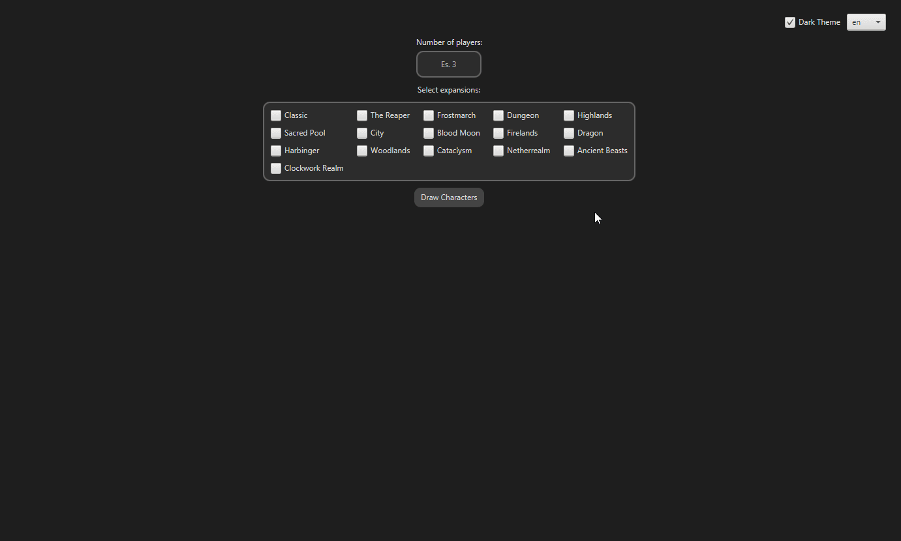

# Talisman Randomizer

[Italiano](README.it.md) 

**TalismanRandomizer** is an unofficial tool designed to support players of *Talisman: The Magical Quest Game*, the famous fantasy board game created by Robert Harris and published by Games Workshop and Fantasy Flight Games.

**Project Goals**  
The reasons behind this project:
- I wanted to create an useful tool and in the same time, train my Java skills.
- I wanted to play the game in a different way.

[!CAUTION]
🔴 **TalismanRandomizer is an unofficial fan-made tool for personal and community use.
It is not affiliated with, supported by, or authorized by Games Workshop, Fantasy Flight Games, Asmodee, or any other rights holders of Talisman.
All names, artwork, and original content remain the property of their respective owners and are used under fair use principles for non-commercial and educational purposes.**

🟢 **Procedure:**  
- **Enter the number of players**  
  In the initial window, you will be asked to enter how many players will take part in the game. The number entered will determine how many characters will be drawn.

- **Select expansions**  
  You can then select, via a simple interface, which Talisman expansions to include in the character pool. Only characters from the selected expansions will be considered in the draw.

- **Draw characters**  
  Once your preferences are set, click on the "Draw Characters" button, and the program will start generating characters.

🔗 **Available Versions**  
Two versions of TalismanRandomizer are available, both created and maintained by me:

**GUI Version:**  
- https://github.com/vinkstandard/TalismanRandomizerFX/tree/master

**Command-Line Version (CMD):** (only available in italian)
- https://github.com/vinkstandard/github-intelliJ/blob/master/src/ChallengeInteressanti/TalismanRandomizer.java

Both versions are available as source code, so anyone interested can study, modify, or adapt the tool for their own needs.

🔴 Distribution and use of the program are permitted, as is code modification for personal or educational purposes.  
🔴 If you wish to publish a modified version of the program, you must include a link to my original GitHub repository as the original author in your project description or README file.

For questions or anything else, here is my Discord ID: **176797901102645248**
